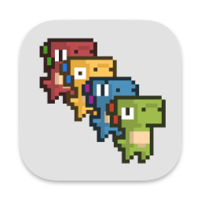

# Pixelous Overlay


OBS overlay created using Pygame that displays each follower/subsciber as a character on the bottom of the screen.

<!-- Add gif of demo here -->
<!--  -->

 ### Instalation/Setup
#### MacOS
Install [pipenv](https://pipenv.pypa.io/en/latest/) and then run the following code:
```
pipenv install  
pipenv shell  
python main.py
```


### Special Thanks
| Name         | Description                                                                  | Socials                                        |
|--------------|------------------------------------------------------------------------------|------------------------------------------------|
| Arks         | Created the Dinosaur character sprites. https://arks.itch.io/dino-characters | Twitter: @ScissorMarks                         |  
| InvalidEntry | For giving inspiration.                                                      | Youtube: https://www.youtube.com/@InvalidEntry |  
| Rik Cross    | For giving inspiration                                                       | Youtube: https://www.youtube.com/@RikCross     |  